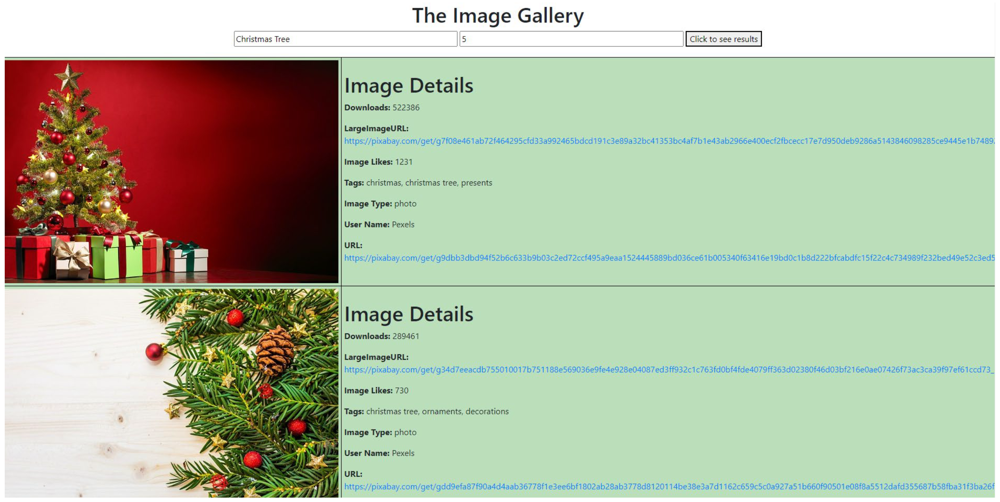
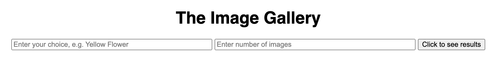
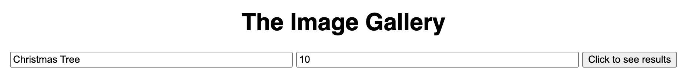

# Axios and Fetch

## Introduction
Ajax is a technology that allows developers to make asynchronous HTTP requests without the need for a
full-page reload.

### Using Fetch
The Fetch API provides an interface for fetching resources. The fetch() method takes one mandatory
argument, the path to the resource you want to fetch, and returns a promise that resolves to the response to
that request (successful or not). Fetch API is built into the window object, and therefore doesn’t need to be
installed as a dependency or imported in client-side code. A basic fetch request looks like this. You can
also use the

``` javascript
fetch(`http://example.com/task.json`)
.then(response=>response.json())
.then(data => console.log(data))
```

### Using Axios
Axios is a Promise-based HTTP client for the browser and Node. It is similar to the Fetch API and returns
a JavaScript Promise object but also includes many powerful features.

### Using Async/Await
Another popular approach for handling promises is to create an async function. Instead of waiting for the
results of a promise to resolve and handling it with a chain of then functions, async functions can be told to
wait for the promise to resolve before further executing any code found in the function. The await keyword
is used before promise calls.

## Part 1
***This is purely client side; there is no need to create a server for this part.***

Demonstrate the use of **Fetch API and Axios** to fetch data from a third-party API and update the
part of the HTML page. You are provided with HTML template named “_imageGallery.html_”. Use [pixabay API](https://pixabay.com/api/docs/) to bring the desired images and image details on your web page (You will have to generate API key to use the API.).

Create **two scripts “fetchapi.js” (using fetch API) and “axios.js” (using Axios)** - you can use async/await or then function. You must link **both the javascript files** to the imageGallery.html file and comment one out. I will uncomment it to see if it is working or not. Both the scripts should accomplish the following task:

When the user enters the search keyword for the image and the number of images to be shown, and hits “**Click to see results**” button, the images and corresponding details for each image like **Downloads, LargeImageURL, Image Likes, Tags, Image Type, User Name, URL** are displayed. Make sure

* the output looks similar to what is shown in Excerpt below. You are free to use your own
colors and font styles for displaying the relevant details.
* you clear the previous results before pasting the new ones.
* raise an alert if the search box for keyword is empty or the number of images is less than 2

The following excerpt shows a portion of the resulting webpage after the user enters the search keyword “**Christmas Tree**” and number of images to be 5




## Part 2
***In the second part, build a server using Node/Express and use Express to render a website with the API data.***

Complete the following fice tasks:
1. **[2 Marks]** Handle a GET request from the client at the root route localhost:3000/. Send back the following HTML file named “_imageGallery2.html_” (not provided by me; you can create this on your own) to the client as the response:

    

2. **[2 Marks]** After the client populates the required form fields (search keyword and the number of images to be displayed), parse the POST request.

    

    Use the parsed data to structure the URL to fetch the image data from an external server.

* Perform validation: if the search box for keyword is empty or the number of images is
less than 2, then send an appropriate status code back to the client. Otherwise, proceed
with the next step.

3. **[8 Marks]** Next, make a GET request to the external Server (at Pixabay API) with the Fetch and Axios (async/await or then functions). You should comment one out, but both modules should work. I will uncomment the code to see if it works fine for both Fetch and Axios. Collect the dynamic image data from the API based on what user typed into the input fields.

4. **[8 Marks]** Create a new template file imageGallery3.ejs or imageGallery3.pug that renders the output as shown in the previous excerpt. Use res.rende (‘imageGallery3.ejs’,{what data you need to pass}) to render this file from your server. You can use EJS or PUG.

## Contact
[Contact the developer](https://www.linkedin.com/in/diegopinlac/)